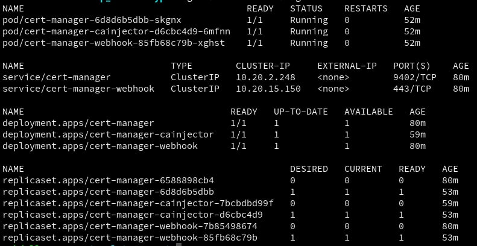

## Use Let’s Encrypt on Kubernetes to Automatically Generate Certs

### Install Kubernetes Cert-Manager 🚀
### Configure Let’s Encrypt 🔐

Cert-Manager automates the provisioning of certificates within Kubernetes clusters. It provides a set of custom resources to issue certificates and attach them to services 

### Create namespace called cert-manager

`kubectl create namespace cert-manager`

### Run following command on cert-manager namespace

`kubectl apply -f https://github.com/cert-manager/cert-manager/releases/download/v1.7.1/cert-manager.yaml`

### Make sure all deployments && services installed successfully 

`kubectl get all -n cert-manager`

## Creating a Certificate Issuer

Issuers and cluster issuers are resources which supply certificates to your cluster. Let’s Encrypt lets you dynamically acquire new certificates for services in your cluster. Provide your email ✉️ in `email` section.

-----------
    apiVersion: cert-manager.io/v1
    kind: ClusterIssuer
    metadata:
      name: letsencrypt-staging
      namespace: cert-manager
    spec:
      acme:
        server: https://acme-staging-v02.api.letsencrypt.org/directory
        email: example@example.com
        privateKeySecretRef:
          name: letsencrypt-staging
        solvers:
         - http01:
            ingress:
              class: nginx
-----------

## Create an Ingress Sample 

`kubectl apply filename.yml`

-----------
    apiVersion: networking.k8s.io/v1
    kind: Ingress
    metadata:
      name: example-ingress
      annotations:
        kubernetes.io/ingress.class: nginx
        cert-manager.io/cluster-issuer: "letsencrypt-staging"
        nginx.ingress.kubernetes.io/proxy-body-size: "0"
        nginx.ingress.kubernetes.io/proxy-read-timeout: "600"
        nginx.ingress.kubernetes.io/proxy-send-timeout: "600"
    spec:
      tls:
      - hosts:
          - <your-domain-name>
        secretName: example-tls
      rules:
        - host: <your-domain-name>
          http:
            paths:
              - path: /
                pathType: Prefix
                backend:
                  service:
                    name: <service-name>
                    port:
                      number: 3000

-----------
Output going to be
`ingress.networking.k8s.io/example-ingress` created

